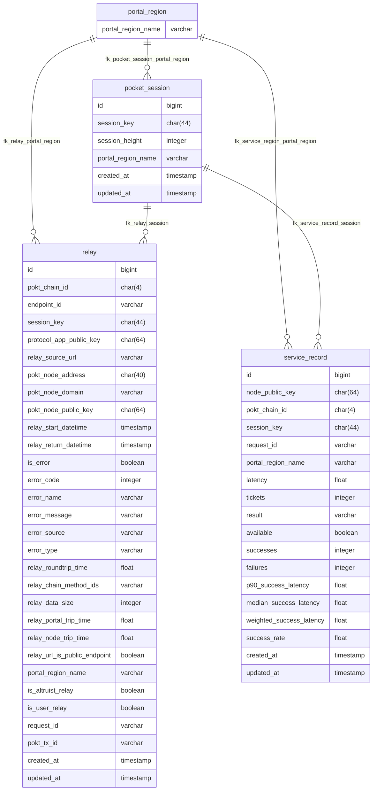

    
    <!-- TODO Rename header -->
    <h1>Transaction DB</h1>
    <big>Driver implementation for the Transaction Database</big>
    

     
        
        
        
    

 

  <!-- TODO Update the nelow section with development instructions (leave the pre-commit section in place) -->

# Development

## Pre-Commit Installation

Before starting development work on this repo, `pre-commit` must be installed.

In order to do so, run the command **`make init-pre-commit`** from the repository root.

Once this is done, the following checks will be performed on every commit to the repo and must pass before the commit is allowed:

### 1. Basic checks

- **check-yaml** - Checks YAML files for errors
- **check-merge-conflict** - Ensures there are no merge conflict markers
- **end-of-file-fixer** - Adds a newline to end of files
- **trailing-whitespace** - Trims trailing whitespace
- **no-commit-to-branch** - Ensures commits are not made directly to `main`

### 2. Go-specific checks

- **go-fmt** - Runs `gofmt`
- **go-imports** - Runs `goimports`
- **golangci-lint** - run `golangci-lint run ./...`
- **go-critic** - run `gocritic check ./...`
- **go-build** - run `go build`
- **go-mod-tidy** - run `go mod tidy -v`

### 3. Detect Secrets

Will detect any potential secrets or sensitive information before allowing a commit.

- Test variables that may resemble secrets (random hex strings, etc.) should be prefixed with `test_`
- The inline comment `pragma: allowlist secret` may be added to a line to force acceptance of a false positive

# Current Schema

